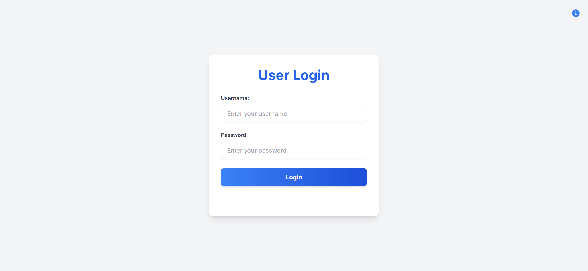
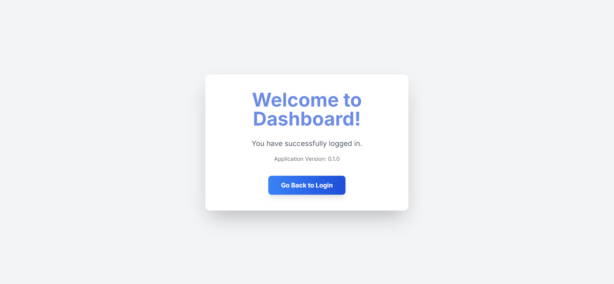
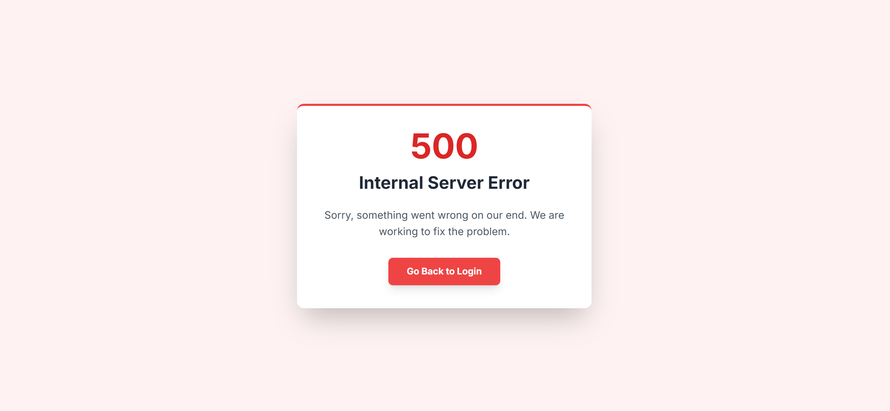
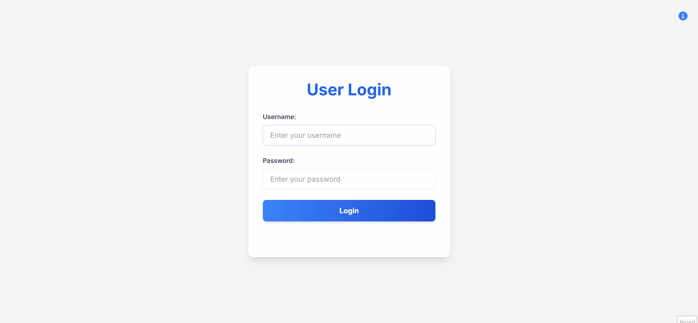

# Rust Axum Authentication Example

[](https://github.com/Meatball-Sub-11/rust-axum-auth-example/actions/workflows/rust.yml)

This project is a simple, self-contained web application built with Rust and the Axum framework. It demonstrates a basic user authentication flow, including user login, password hashing and a protected dashboard page.

## Screenshots

<table>
  <tr>
    <td align="center"><strong>Login Page</strong></td>
    <td align="center"><strong>Dashboard (Successful Login)</strong></td>
    <td align="center"><strong>Error Page (500)</strong></td>
  </tr>
  <tr>
    <td>
      <a href="docs/assets/login-page.png">
        
      </a>
    </td>
    <td>
      <a href="docs/assets/dashboard-page.png">
        
      </a>
    </td>
    <td>
      <a href="docs/assets/error-page.png">
        
      </a>
    </td>
  </tr>
</table>

## Demo



## Features

- **REST API:** A backend API with endpoints for status (`/status`) and login (`/login`).
- **Web UI:** A simple frontend with a login page and a dashboard, rendered using Askama templates.
- **Backend Hashing:** Passwords are sent from the client as a SHA-256 hash and compared against the backend user data.
- **File-Based Storage:** User credentials are saved in a simple `users.txt` JSON file instead of a database.
- **Manual SHA-256 Implementation:** A separate branch (`V3-Manual-sha256`) contains a from-scratch implementation of the SHA-256 hashing algorithm for educational purposes.

## API Endpoints

| Method | Path          | Description                                     |
|--------|---------------|-------------------------------------------------|
| `GET`  | `/`           | Serves the HTML login page.                     |
| `GET`  | `/dashboard`  | Serves the protected dashboard page.            |
| `GET`  | `/status`     | Returns a JSON object with API status & version.|
| `POST` | `/login`      | Authenticates a user with a JSON payload.       |
| `GET`  | `/test-error` | Intentionally triggers a 500 error page.        |

## Tech Stack

- **Backend:** Rust, Axum, Tokio, Serde, Askama
- **Frontend:** HTML5, Tailwind CSS (via CDN), JavaScript (for hashing)

## How to Run

1. Clone the repository.
2. Make sure you have Rust installed.
3. Navigate to the project directory and run the application:
   ```bash
   cargo run
   ```
4. Open your browser and go to `http://localhost:3000`.

## Branch Information

- **`main` / `v2`:** The primary version of the application. It uses the `sha2` crate for backend password hashing.
- **`phase3-manual-sha`:** An experimental branch that uses a manual, from-scratch implementation of SHA-256 for hashing. **This is for educational purposes only.**

## License

This project is licensed under the MIT License - see the `LICENSE` file for details.

For a full list of third-party libraries and their licenses, please see the [licenses.txt](docs/licenses.txt) file.
